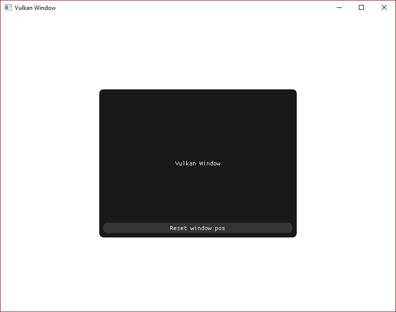

<div align="center">

  <h1>VulkanWindow</h1>

  <a href="https://github.com/gage-lodba/VulkanWindow/actions/workflows/build.yml">
    
  </a>

</div>

A minimalistic project designed for straightforward window creation using ImGui, GLFW, and Vulkan. It provides a hassle-free environment for developing graphical user interfaces with ease.

<div align="center">
  
</div>

## Building from source

### Dependencies

[CMake](https://cmake.org/) is an open-source, cross-platform family of tools designed to build, test and package software.

[Vulkan SDK](https://www.vulkan.org/) is a cross-platform industry standard enabling developers to target a wide range of devices with the same graphics API.

### Building

```bash
cmake -B build
cmake --build build --config Release
```
