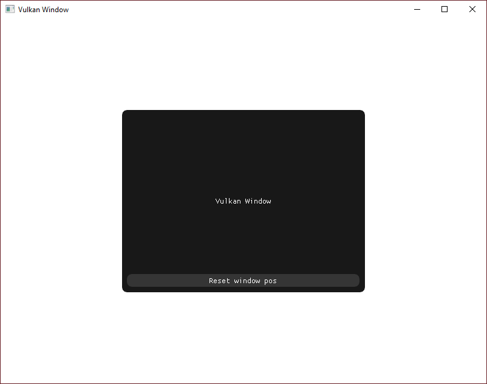

<div align="center">

  <h1>VulkanWindow</h1>

  <a href="https://github.com/gage-lodba/VulkanWindow/actions/workflows/build.yml">
    
  </a>

</div>

A minimalistic C++20 scaffold for building Vulkan + Dear ImGui + GLFW
applications. Provides a windowed Vulkan renderer with depth, swap-chain
recreation, persistent pipeline cache, and an ImGui frame loop — so apps can
focus on their own geometry and UI.

<div align="center">
  
</div>

## Quick start

```cpp
#include "Application.h"
#include "UserInterface.h"

int main() {
    Application app;

    UserInterface ui;
    app.setUICallback([&ui] { ui.render(); });

    // Optional: draw your own Vulkan geometry between BeginRenderPass and
    // ImGui (ImGui composites on top).
    app.setRenderCallback([](VkCommandBuffer cmd, VkExtent2D extent) {
        // vkCmdBindPipeline / vkCmdDraw / etc. here.
    });

    app.run();
}
```

## Building from source

### Dependencies

- [CMake](https://cmake.org/) ≥ 3.12
- [Vulkan SDK](https://www.vulkan.org/) (or system Vulkan headers + loader)
- A C++20 compiler (GCC 10+, Clang 11+, MSVC 19.30+)

GLFW, Dear ImGui, and VulkanMemoryAllocator are vendored as git submodules
under `deps/`.

### Build

```bash
git submodule update --init --recursive
cmake -B build -DCMAKE_BUILD_TYPE=Release
cmake --build build --config Release

./build/VulkanWindow            # Linux
./build/Release/VulkanWindow.exe  # Windows / MSVC
```

### CMake options

| Option | Default | Description |
| --- | --- | --- |
| `VULKANWINDOW_BUILD_DEMO` | `ON` if top-level, else `OFF` | Build the `VulkanWindowDemo` executable. |
| `VULKANWINDOW_BUILD_EXAMPLES` | `ON` if top-level, else `OFF` | Build the example executables under `examples/`. Needs `glslc` (Vulkan SDK); skipped with a message if absent. |
| `VULKANWINDOW_BEST_PRACTICES` | `OFF` | In Debug builds, enable `VK_VALIDATION_FEATURE_ENABLE_BEST_PRACTICES_EXT`. |

## Examples

Two self-contained, copy-pasteable references under `examples/` (built when
`glslc` is available; skipped without failing the build otherwise):

- **`triangle/`** — the minimal "bring your own geometry" path: a `VkPipeline`
  from GLSL (compiled to SPIR-V by `glslc` and embedded into the binary), a
  vertex-buffer-free coloured triangle drawn through `setRenderCallback` with
  ImGui composited on top, dynamic viewport+scissor, and a pipeline rebuilt only
  on a surface-format change via `setSwapchainRecreatedCallback`.
- **`textured_quad/`** — the full helper surface end-to-end: a vertex buffer
  (`createDeviceLocalBuffer`), a mipmapped texture + sampler (`createTexture2D` /
  `createSampler`), a descriptor set (`createDescriptorSetLayout` /
  `createDescriptorPool` / `allocateDescriptorSet` /
  `updateImageSamplerDescriptor`), and a pipeline with vertex input + the
  descriptor layout — built entirely against the `getContext()` / `getSwapchain()`
  handles.

```bash
cmake -B build -DCMAKE_BUILD_TYPE=Release
cmake --build build --config Release
./build/examples/triangle/VulkanWindowTriangle
./build/examples/textured_quad/VulkanWindowTexturedQuad
```

### Compiling your own shaders

Linking VulkanWindow (via `add_subdirectory`/`FetchContent`, or
`find_package`) also gives you a CMake helper, `vulkanwindow_add_shaders`, that
compiles GLSL to SPIR-V (`glslc`) and embeds it as a C initializer list your
C++ can `#include` — no runtime shader files to ship:

```cmake
add_executable(my_app main.cpp)
vulkanwindow_add_shaders(my_app
  ${CMAKE_CURRENT_SOURCE_DIR}/shader.vert
  ${CMAKE_CURRENT_SOURCE_DIR}/shader.frag)
target_link_libraries(my_app PRIVATE VulkanWindow::VulkanWindow)
```

```cpp
constexpr uint32_t kVertSpv[] =
#include "shader.vert.spv.inc"
    ;
// ... pass kVertSpv / sizeof(kVertSpv) to VkShaderModuleCreateInfo.
```

The stage is inferred from each file's extension. `VULKANWINDOW_GLSLC_FOUND`
tells you whether `glslc` was located (guard the call with it if shaders are
optional); override discovery with `-DVULKANWINDOW_GLSLC=/path/to/glslc`. The
triangle example uses this exact helper.

### Resource helpers

`#include "VulkanResources.h"` for `vkutil::` helpers that cover the buffer
boilerplate every non-trivial renderer reimplements — built on the handles from
`getContext()`:

```cpp
#include "VulkanResources.h"
const VulkanContext &ctx = app.getContext();

// Device-local buffer, uploaded via an internal staging buffer + one-shot copy.
vkutil::Buffer vbuf = vkutil::createDeviceLocalBuffer(
    ctx.allocator, ctx.device, ctx.graphicsQueue, ctx.graphicsQueueFamily,
    vertices.data(), vertices.size() * sizeof(Vertex),
    VK_BUFFER_USAGE_VERTEX_BUFFER_BIT);

// Host-visible, persistently-mapped buffer for CPU-written data (uniforms,
// dynamic vertices). Write through `.mapped`.
vkutil::Buffer ubuf = vkutil::createMappedBuffer(
    ctx.allocator, sizeof(Ubo), VK_BUFFER_USAGE_UNIFORM_BUFFER_BIT);
std::memcpy(ubuf.mapped, &ubo, sizeof(ubo));

// ... use vbuf.buffer / ubuf.buffer in your draws ...

vkutil::destroyBuffer(ctx.allocator, vbuf);
vkutil::destroyBuffer(ctx.allocator, ubuf);
```

Also provides `beginSingleTimeCommands` / `endSingleTimeCommands` for your own
one-shot GPU work (copies, layout transitions). `createDeviceLocalBuffer`
blocks until the upload completes, so it's for load-time uploads, not the
per-frame hot path — for per-frame data use a mapped buffer (one per
`getFramesInFlight()` slot) and write it from `getCurrentFrameIndex()`.

Textures come with the same one-call treatment — staged upload, layout
transitions, optional mipmaps, and a view, all handled for you:

```cpp
// pixels: width*height RGBA8 texels (e.g. from stb_image).
vkutil::Image tex = vkutil::createTexture2D(
    ctx.allocator, ctx.physicalDevice, ctx.device, ctx.graphicsQueue,
    ctx.graphicsQueueFamily, pixels, width * height * 4, width, height,
    VK_FORMAT_R8G8B8A8_SRGB, /*generateMipmaps=*/true);
VkSampler sampler = vkutil::createSampler(ctx.device);

// tex.view + sampler go into a combined-image-sampler descriptor...

vkutil::destroyImage(ctx.allocator, ctx.device, tex);
vkDestroySampler(ctx.device, sampler, nullptr);
```

`transitionImageLayout` is exposed for your own images. Mipmap generation needs
the format to support linear-filter blitting (it throws otherwise); `createSampler`
leaves anisotropy off since that device feature isn't enabled by the scaffold.

`#include "VulkanDescriptors.h"` for the descriptor-set boilerplate — layout,
pool, allocation, and writes:

```cpp
VkDescriptorSetLayout layout = vkutil::createDescriptorSetLayout(
    ctx.device, {{0, VK_DESCRIPTOR_TYPE_COMBINED_IMAGE_SAMPLER,
                  VK_SHADER_STAGE_FRAGMENT_BIT}});
VkDescriptorPool pool = vkutil::createDescriptorPool(
    ctx.device, {{VK_DESCRIPTOR_TYPE_COMBINED_IMAGE_SAMPLER, 1}}, /*maxSets=*/1);
VkDescriptorSet set = vkutil::allocateDescriptorSet(ctx.device, pool, layout);
vkutil::updateImageSamplerDescriptor(ctx.device, set, 0, tex.view, sampler);
// (updateBufferDescriptor for uniform/storage buffers)
```

The **`textured_quad`** example wires buffers, a texture, a sampler, and a
descriptor set into one pipeline — a complete worked reference.

## Using as a library

VulkanWindow is also a static library you can consume from another CMake
project. Two paths:

### `add_subdirectory`

```cmake
add_subdirectory(third_party/VulkanWindow)

target_link_libraries(my_app PRIVATE VulkanWindow::VulkanWindow)
```

The `VulkanWindow::VulkanWindow` alias transitively brings in headers and
linkage for GLFW, Vulkan, VMA, and Dear ImGui. If your project already
defines targets named `glfw`, `imgui`, or `GPUOpen::VulkanMemoryAllocator`,
VulkanWindow's `CMakeLists.txt` guards `add_subdirectory(deps/...)` with
`if(NOT TARGET ...)` so your copies win.

### `FetchContent`

```cmake
include(FetchContent)
FetchContent_Declare(
  VulkanWindow
  GIT_REPOSITORY https://github.com/gage-lodba/VulkanWindow.git
  GIT_TAG main
  GIT_SUBMODULES_RECURSE TRUE)
FetchContent_MakeAvailable(VulkanWindow)

target_link_libraries(my_app PRIVATE VulkanWindow::VulkanWindow)
```

Parent-provided `imgui` must include the Vulkan and GLFW backends and be Dear
ImGui ≥ 1.92.2 (the renderer uses `PipelineInfoMain`, introduced in that
version).

## Application API

| Method | Purpose |
| --- | --- |
| `setUICallback(fn)` | Invoked each frame between `ImGui::NewFrame()` and `ImGui::Render()` for app ImGui draws. |
| `setRenderCallback(fn)` | Invoked inside the render pass, before ImGui, with the command buffer + swap-chain extent for app geometry. |
| `setStyleCallback(fn)` | Replaces the built-in ImGui dark theme. Applied immediately. |
| `setSwapchainRecreatedCallback(fn)` | Fired after a swap-chain rebuild (resize / present-mode / format change) with a `SwapchainRecreateInfo`. Device is idle; rebuild format-/extent-dependent resources here. |
| `setClearColor(r, g, b, a)` | Linear-RGBA colour cleared at frame start. Default is opaque black. |
| `setPresentMode(mode)` | Switch between `Vsync` / `Mailbox` / `Immediate` at runtime; triggers a swap-chain rebuild. |
| `setKeyCallback(fn)` | GLFW key events. ImGui's chained handlers continue to fire. |
| `setCursorPosCallback(fn)` / `setMouseButtonCallback(fn)` / `setScrollCallback(fn)` / `setCharCallback(fn)` | Other input events. |
| `getContext()` | Read-only `const VulkanContext &` — device, physical device, queues, VMA allocator, pipeline cache. |
| `getSwapchain()` | Read-only `const Swapchain &` — render pass, extent, colour/depth formats, image views, framebuffers. |
| `getFramesInFlight()` | Frames queued ahead of the GPU; size per-frame resources by this. |
| `getCurrentFrameIndex()` | In-flight slot being recorded; valid during `setRenderCallback`. Index per-frame resources with it. |

ImGui's GLFW backend chains alongside the user's callbacks, so events ImGui
consumed (text input into a focused widget, mouse over a window) fire on both
paths. If the app should ignore those, filter on
`ImGui::GetIO().WantCaptureKeyboard` / `WantCaptureMouse`.

### Building your own pipelines

See [`examples/triangle/`](examples/triangle/) for a complete, runnable version
of everything below — pipeline creation, shader embedding, dynamic state, and
format-change handling.

`setRenderCallback` hands you a command buffer with the main render pass already
begun. To record real geometry, build a `VkPipeline` once (after constructing
`Application`, before `run()`) using the interop accessors, then bind and draw
inside the callback:

```cpp
#include "VulkanContext.h"
#include "Swapchain.h"

Application app;
const VulkanContext &ctx = app.getContext();
VkRenderPass pass = app.getSwapchain().renderPass;
// Create a VkPipeline against ctx.device + pass + ctx.pipelineCache,
// allocate buffers from ctx.allocator (VMA), size per-frame data by
// app.getFramesInFlight()...

app.setRenderCallback([&](VkCommandBuffer cmd, VkExtent2D extent) {
  // Bind the pipeline and draw; index per-frame data by
  // app.getCurrentFrameIndex(). Prefer dynamic viewport+scissor (set from
  // `extent`) so a resize never forces pipeline recreation.
});
app.run();
```

The `VulkanContext` reference is stable for the app's lifetime. The `Swapchain`
object is stable too, but the handles inside it (render pass, formats, extent,
image views) are replaced when the swap-chain is rebuilt on resize / present-mode
/ format change — re-read them each frame. Only a surface-**format** change makes
existing pipelines incompatible; a plain resize doesn't if you use dynamic
viewport+scissor.

To react to those rebuilds, register `setSwapchainRecreatedCallback`. It fires
after each rebuild (not for the initial swap-chain), with the device idle, so
it's the safe place to destroy and recreate format-dependent pipelines:

```cpp
#include "VulkanRenderer.h"  // SwapchainRecreateInfo

app.setSwapchainRecreatedCallback([&](const SwapchainRecreateInfo &info) {
  if (info.formatChanged) {
    // Render pass changed — recreate pipelines against app.getSwapchain().renderPass.
  }
  if (info.imageCountChanged) { /* resize per-image resources */ }
  // info.extent is the new size; with dynamic viewport+scissor a plain resize
  // needs no pipeline work at all.
});
```

## Architecture

```
Application
├── Window                  GLFW window + input/resize forwarding
└── VulkanRenderer          per-frame loop, swap-chain, render pass, depth
    ├── VulkanContext       instance/device/queues/allocator/pipeline cache
    └── ImGuiManager        imgui_impl_vulkan + imgui_impl_glfw + descriptor pool
```

- **`VulkanContext`** owns long-lived Vulkan state that doesn't depend on the
  swap-chain. Survives swap-chain rebuilds. Pipeline cache is persisted to a
  per-user cache directory across runs.
- **`VulkanRenderer`** owns the swap-chain, depth attachment, render pass,
  framebuffers, command pool/buffers, sync primitives, and `ImGuiManager`.
  Handles resize via `recreateSwapChain()`.
- **`ImGuiManager`** is the only translation unit that touches
  `imgui_impl_*`.

See [`CLAUDE.md`](CLAUDE.md) for the full architecture notes and
[`IMPROVEMENTS.md`](IMPROVEMENTS.md) for the backlog.

## CI

GitHub Actions builds Release configurations on `windows-latest` and
`ubuntu-latest` and runs `clang-tidy` (with `-warnings-as-errors='*'`) on
Linux. Binaries are uploaded as workflow artifacts on every push; a GitHub
Release is published only when a `v*` tag is pushed.

A **smoke-test** job builds a Debug configuration (validation layers and
synchronization validation compiled in) and runs the demo headlessly on Linux
under Mesa **lavapipe** (software Vulkan) inside `xvfb`, with validation
errors made fatal. This catches runtime regressions — invalid API usage,
synchronization hazards — that compile and lint cleanly. The release job is
gated on it.

### Headless / CI environment variables

| Variable | Effect |
| --- | --- |
| `VULKANWINDOW_MAX_FRAMES` | Render this many frames then exit cleanly (0 status). Unset / `0` runs until the window is closed. |
| `VULKANWINDOW_VALIDATION_ABORT` | When set (non-empty, non-`0`), abort the process with a non-zero status on any validation **error** or sync-validation hazard. Debug builds only — validation isn't compiled into Release. Warnings (incl. best-practices) never abort. |
| `VULKANWINDOW_DEVICE_INDEX` | Force a physical-device enumeration index instead of auto-scoring (testing / multi-GPU). |
| `VULKANWINDOW_BEST_PRACTICES` (CMake option) | Compile in best-practices validation in Debug builds. Off by default. |
